# Hey guyss dean (deanxbox) here 😅

<p align="center">
  
</p>

Software engineer who spends an unreasonable amount of free time messing with **Minecraft mods**, **Vencord plugins**, random scripts, and my PC.

Mostly self-taught, with a background in software engineering and a tendency to learn things by breaking them first.

```text
> java
> typescript
> javascript
> python
> arch btw
```

## `~/about-me`

* 💻 Software Engineer
* ⛏️ Mostly building **Minecraft mods** in my free time
* 🧩 Occasionally making **Vencord plugins**
* 🐧 I use **Arch btw**
* 🪟 Also write the occasional Windows/Linux script
* 🐍 Python was my first language
* 🎮 I play a lot of Minecraft
* 🏋️ Casual gym goer
* 🖥️ Probably customising my PC instead of leaving it alone

## `~/stack`

<p>
  
</p>

**Mainly:** Java · TypeScript · JavaScript
**Also experienced with:** Python

## `~/find-me`

[](https://modrinth.com/user/deanxbox)


## `~/pc`

```yaml
CPU:
  AMD Ryzen 9 9900X
  12 Cores / 24 Threads

RAM:
  64GB DDR5 @ 6000 MT/s

GPU:
  - NVIDIA GeForce RTX 5070 Ti
  - NVIDIA GeForce RTX 4060 Ti

Motherboard:
  MSI MAG X870 TOMAHAWK WIFI

Storage:
  - Samsung SSD 860 EVO 1TB
  - Fanxiang S880 1TB
  - Lexar ARES PRO 1TB
  - Lexar EQ790 4TB

OS:
  Microsoft Windows 11 Pro
```

> yes, there are two GPUs. no, I will not be taking questions.

## `~/github`

<p align="center">
  
</p>

<p align="center">
  
</p>

---

```text
dean@deanxbox ~
❯ probably working on something minecraft related
```
